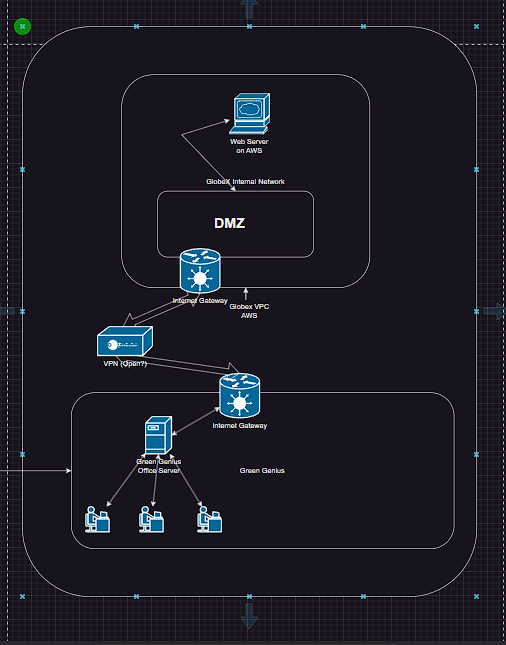

# How will you manage and maintain network security?

 

## Purpose

* This SOP is to establish the standardized practices and guidelines for ensuring the network is secure and maintained properly.

 

## Scope

* This SOP is to be performed and maintained by the IT department only.

 

## Responsibilities

* Implement and maintain network upgrades based on best practices.

* Conduct regular assessments and audits.

* Document network configurations, changes, and security measures for reference.

 

## Procedure

* Design the architecture based on end-user needs, budget, and any other relevant considerations.

* Implement port and firewall configuration on all networked devices.
  * [Network connectivity guide](https://docs.google.com/document/d/1VLcArFshXQOc83mTYLSrvzxAdJV0QGRttbriUhKnJd8/edit#heading=h.euyi6w8xahvc))

* Install and configure (pfSense) router.
  * [pfSense install guide](https://docs.google.com/document/d/1rELJwMH2R1L3TIMe35UzqGX_wh7L4ioX3bVu6piKYDc/edit?usp=sharing))

* Test network performance.

* Monitor network performance and implement network monitoring tools as necessary.

* Regularly review network logs to identify and respond to incidents.
  * [Log review and analysis guide](https://docs.google.com/document/d/16TP9OtI3wJnahwPr5ncKMYu3LCgk8Owx9WUUp-31zpI/edit#heading=h.jnbf42tnm52g))

* Conduct routine maintenance such as backups, firmware upgrades, and system health checks.

 

## References

* [Network connectivity guide](https://docs.google.com/document/d/1VLcArFshXQOc83mTYLSrvzxAdJV0QGRttbriUhKnJd8/edit#heading=h.euyi6w8xahvc)

* [pfSense guide](https://docs.google.com/document/d/1rELJwMH2R1L3TIMe35UzqGX_wh7L4ioX3bVu6piKYDc/edit?usp=sharing)

* [Log review and analysis guide](https://docs.google.com/document/d/16TP9OtI3wJnahwPr5ncKMYu3LCgk8Owx9WUUp-31zpI/edit#heading=h.jnbf42tnm52g)

 

## Definitions

* ***Network Infrastructure*** - The hardware, software, and protocols that enable the communication and connectivity within an organization's network.

* ***Network Security*** - The practices and measures taken to protect the confidentiality, integrity, and availability of network resources and data.

 

## Revision History

* 06/19/2023 - Raphael Chookagian
* 06/20/2023 - Raphael Chookagian
* 06/21/2023 - Raphael Chookagian
